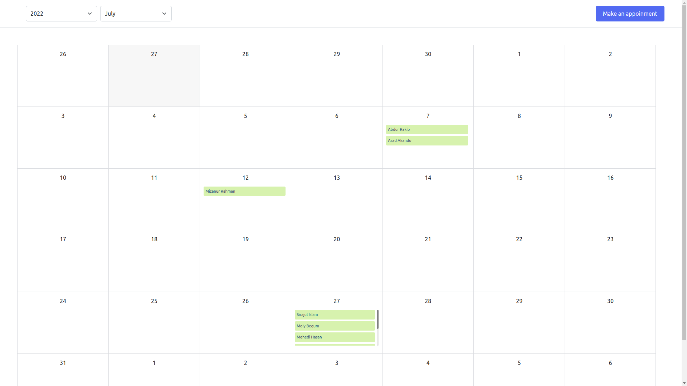

# Simple Doctor Appoinment Calender

    <kbd>
        
    </kbd>

## Description
1. A doctor appointment calendar monthly view . Each day of the month has a fixed size like a calendar.
2. Each day of the month contains an appointment list. 3 items at a glance and the rest of them are scrollable. This appointment list is  sorted by appointment time.
3. By Clicking on an appointment, it opens a modal which will contain details of the appointment.
4. Header of the calendar view has 2 dropdown menus. First one is for the month list and the other will contain the year range 2019-2021.
5. Used react router dom to change the month and year of the calendar, example : **localhost/year/2020/month/7**. Root url It will always contain the current month.
6. Header of the calendar also contains a create appointment button . By clicking on it, a modal is opened with a form of appointment which will take input of **name**, **gender**, **age**, **date**, **time**. Used React-hook-form to take these inputs.
7. Used Redux/Mobx as store management. And To persist data use local storage or indexDB.
8. Used Hook and functional approach for creating components

 

## Used tools
### Primary
- React
- Styled Components ( for styling stuffs )
- Redux ( for state management )
- React Hook Form ( for taking input for appointment )
### Secondary
- DateJs ( for extract dates )
- React Icons ( for showing some icons )
- React Hot Toast ( for toast message )
- Material UI ( for date and time picker )